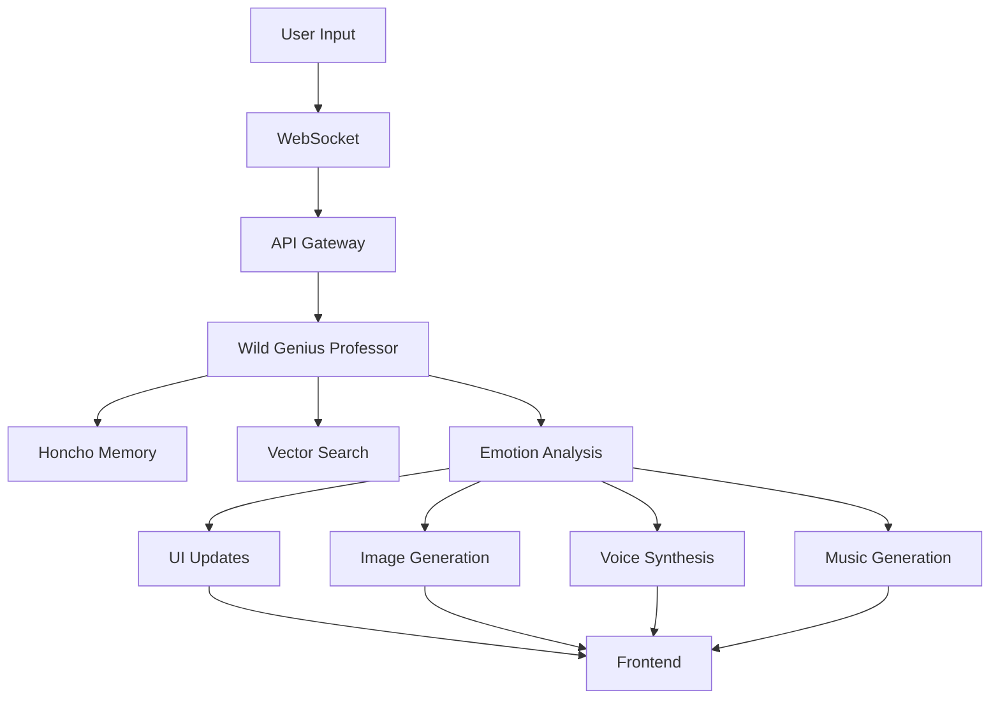

# Virtual Literature Companion - System Architecture

## Overview

The Virtual Literature Companion is built as a distributed system with multiple interconnected services that work together to create an immersive, emotionally-aware literature discussion experience.

## Core Components

### 1. Wild Genius Professor Agent (Brain)

The heart of the system is the LangGraph-based conversational agent that embodies the "Wild Genius Professor" persona.

**Key Features:**
- **State Machine Architecture**: Uses LangGraph to manage conversation flow
- **Emotional Awareness**: Tracks and expresses 10 distinct emotional states
- **Memory System**: Integrates with Honcho for persistent memory and user modeling
- **Tool Integration**: Uses specialized tools for citations, spoiler protection, and multimedia generation

**Flow:**
```
User Input → Check Reading Progress → Analyze Emotion → Generate Response → 
Enhance with Multimedia → Save to Memory → Return Response
```

### 2. Text Processing Pipeline

Handles the ingestion and preparation of literary texts for discussion.

**Components:**
- **PDF Extractor**: Extracts text from book PDFs
- **TOC Parser**: Identifies and parses table of contents
- **Text Chunker**: Semantically chunks text for retrieval
- **Citation Index**: Creates searchable index with page/chapter references
- **Spoiler Guard**: Filters content based on reading progress

### 3. Multimedia Generation Layer

Three parallel services that create the immersive experience:

#### Image Generation
- Maintains consistent artistic style per book
- Adapts imagery based on emotional state
- Uses DALL-E 3 / Stable Diffusion

#### Voice Synthesis
- Emotionally-aware TTS with ElevenLabs
- Dynamic voice modulation
- Real-time streaming

#### Music Generation
- Procedural music based on emotional themes
- Smooth transitions between states
- Ambient, non-intrusive soundscapes

### 4. API Layer (FastAPI)

RESTful and WebSocket APIs that coordinate all services.

**Endpoints:**
- `/chat` - WebSocket for real-time conversation
- `/books` - Book management and upload
- `/generation` - Multimedia generation endpoints
- `/user` - User profiles and progress

### 5. Frontend (React + Three.js)

Dynamic UI that responds to emotional states.

**Features:**
- **Emotive Shape**: 3D shape that morphs with emotions
- **Dynamic Theming**: Colors and animations change in real-time
- **Chat Interface**: Displays messages with emotional styling
- **Image Gallery**: Shows generated images alongside conversation

## Data Flow



## Emotional State System

The system's unique feature is how emotions permeate every layer:

1. **Detection**: LLM generates emotion tags in responses
2. **Propagation**: Emotions trigger changes across all services
3. **Expression**: UI, voice, music, and images all reflect the current state
4. **Transition**: Smooth morphing between emotional states

## Integration Points

### Honcho Integration
- Stores conversation history
- Builds user psychological profiles
- Provides theory of mind insights
- Enables personalized responses

### Vector Database
- ChromaDB for semantic search
- Stores text chunks with embeddings
- Enables citation lookup
- Supports spoiler-safe retrieval

### External APIs
- OpenAI/Anthropic for LLM
- DALL-E 3 for images
- ElevenLabs for voice
- Real-time synthesis coordination

## Performance Optimizations

1. **Streaming Everything**
   - LLM responses stream token by token
   - Voice synthesis streams audio chunks
   - UI updates animate smoothly

2. **Parallel Processing**
   - Multimedia generation happens async
   - Multiple services work simultaneously
   - Smart queueing prevents bottlenecks

3. **Caching Strategy**
   - Common responses cached
   - Generated media stored
   - User preferences remembered

## Security Considerations

- API key management via environment variables
- Rate limiting on all endpoints
- Content filtering for appropriate discussions
- User data encryption
- Secure WebSocket connections

## Scalability Design

The architecture supports horizontal scaling:

1. **Stateless API**: Can run multiple instances
2. **Queue-based Generation**: Media generation can be distributed
3. **CDN for Assets**: Static content served globally
4. **Database Sharding**: User data can be partitioned

## Future Architecture Enhancements

1. **Microservices Migration**: Break into smaller, independent services
2. **Event-Driven Architecture**: Use message queues for better decoupling
3. **ML Pipeline**: Add custom model training for personalization
4. **Real-time Collaboration**: Support multiple users discussing together
5. **Mobile Architecture**: Native apps with offline support